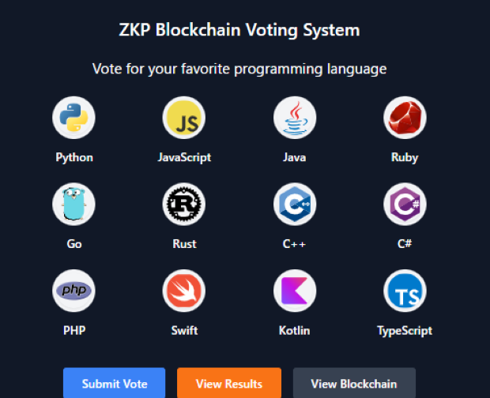
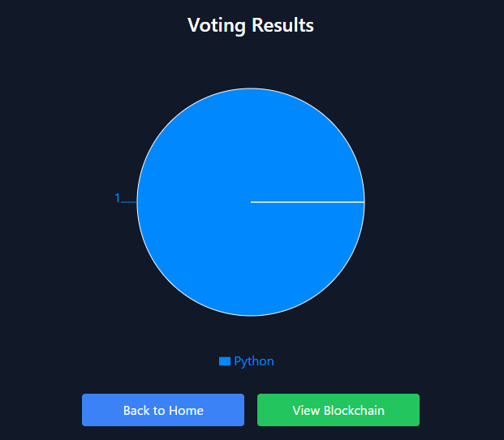
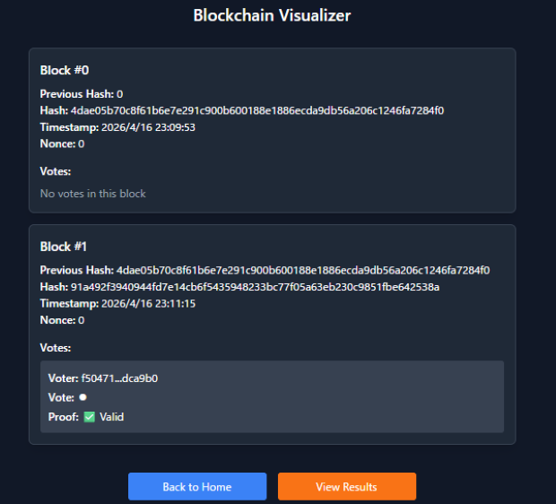

# ZKP-Ready Blockchain Voting System

## Overview

This project is a personal prototype of a blockchain-based electronic voting system, designed to explore secure and transparent digital voting architectures.

It is not a full Zero-Knowledge Proof (ZKP) implementation, but is structured as a ZKP-ready architecture, designed with future integration of zero-knowledge proof systems in mind.

The system also includes two backend implementations (Python and Go) to evaluate architectural consistency and performance across different languages.


## Key Features

- **Digital Signature Verification**  
  Votes are signed client-side using ECDSA and verified on the backend.

- **Blockchain-Based Vote Storage**  
  Votes are stored in a chain of cryptographically linked blocks.

- **Tamper Detection**  
  Any modification in the blockchain can be detected through hash validation.

- **One Vote Per Public Key**  
  Prevents double voting using public key uniqueness constraints.

- **ZKP-Ready Verification Layer (Stub)**  
  Abstract verification interface prepared for future zero-knowledge proof integration.

- **Dual Backend Implementation**
  - Python (FastAPI): rapid prototyping
  - Go (Gin): performance and concurrency comparison

## Security Design

### 1. Digital Signature Verification

Each vote is signed using the voter’s private key and verified using the corresponding public key.

- Prevents impersonation
- Ensures vote authenticity
- Private keys are never transmitted to the server

### 2. Double Voting Prevention

Each public key is allowed to vote only once.
```
public_key → unique constraint
```

### 3. Blockchain Integrity

Votes are stored in a linked blockchain structure:
```
block.hash → next_block.previous_hash
```
This ensures full tamper resistance and traceability.

### 4. ZKP-Ready Layer (Stub)

The system includes an abstract proof verification layer:
```
verify_proof(proof)
```
Currently implemented as a lightweight stub, but designed to be replaced with:

- zkSNARK / zkSTARK verification
- Commitment-based voting systems
- Anonymous voting mechanisms

## Tech Stack

### Frontend
- React
- TypeScript
- Vite

### Backend
- FastAPI (Python)
- Gin (Go)

### Cryptography
- ECDSA (secp256k1)
- SHA-256


## Screenshots

### Voting Interface



### Vote Results



### Blockchain Visualizer



## How to Use

1. Launch the backend (`docker-compose build && docker-compose up -d`)
2. Start the frontend 
- Python: (`cd frontend && npm install && npm run dev:python`)
- Go: (`cd frontend && npm install && npm run dev:go`)
3. Open the UI in your browser

## Voting Flow
1. Generate or load a key pair (stored in localStorage)
2. Sign the vote in the browser
3. Submit the vote to the backend
4. Backend verifies signature and ZKP stub
5. Vote is added to the blockchain
6. Results are updated
